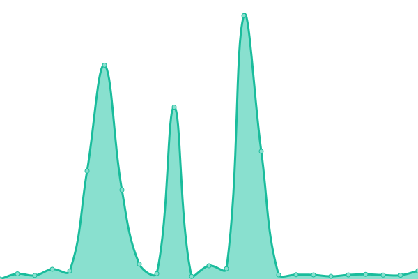
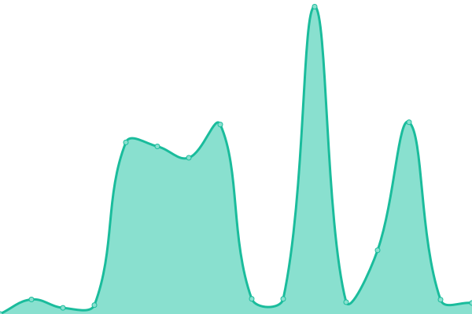

# [📈 Live Status](https://demo.upptime.js.org): <!--live status--> **🟧 Partial outage**

This repository contains the open-source uptime monitor and status page for [AHQMiness](https://github.com/ahqsoftwares), powered by [Upptime](https://github.com/upptime/upptime).

With [Upptime](https://upptime.js.org), you can get your own unlimited and free uptime monitor and status page, powered entirely by a GitHub repository. We use [Issues](https://github.com/ahqsoftwares/uptime-2/issues) as incident reports, [Actions](https://github.com/ahqsoftwares/uptime-2/actions) as uptime monitors, and [Pages](https://demo.upptime.js.org) for the status page.

<!--start: status pages-->
<!-- This summary is generated by Upptime (https://github.com/upptime/upptime) -->
<!-- Do not edit this manually, your changes will be overwritten -->
<!-- prettier-ignore -->
| URL | Status | History | Response Time | Uptime |
| --- | ------ | ------- | ------------- | ------ |
|  [Dashboard](https://guard-bot.ahq-alt.repl.co/) | 🟩 Up | [dashboard.yml](https://github.com/ahqsoftwares/uptime-2/commits/HEAD/history/dashboard.yml) | 

 3078ms
     
 | 

<a href="https://ahqsoftwares.github.io/uptime-2/history/dashboard">83.22%</a>
    

|  [Beta Dashboard](https://guard-bot-beta.ahq-alt.repl.co/) | 🟩 Up | [beta-dashboard.yml](https://github.com/ahqsoftwares/uptime-2/commits/HEAD/history/beta-dashboard.yml) | 

 5475ms
     
 | 

<a href="https://ahqsoftwares.github.io/uptime-2/history/beta-dashboard">100.00%</a>
    

|  [Bot](https://ahq-miness.ahqsecret.repl.co/) | 🟥 Down | [bot.yml](https://github.com/ahqsoftwares/uptime-2/commits/HEAD/history/bot.yml) | 

 3611ms
     
 | 

<a href="https://ahqsoftwares.github.io/uptime-2/history/bot">82.52%</a>
    

<!--end: status pages-->

[**Visit our status website →**](https://demo.upptime.js.org)

## 📄 License

- Powered by: [Upptime](https://github.com/upptime/upptime)
- Code: [MIT](./LICENSE) © [AHQMiness](https://github.com/ahqsoftwares)
- Data in the `./history` directory: [Open Database License](https://opendatacommons.org/licenses/odbl/1-0/)
